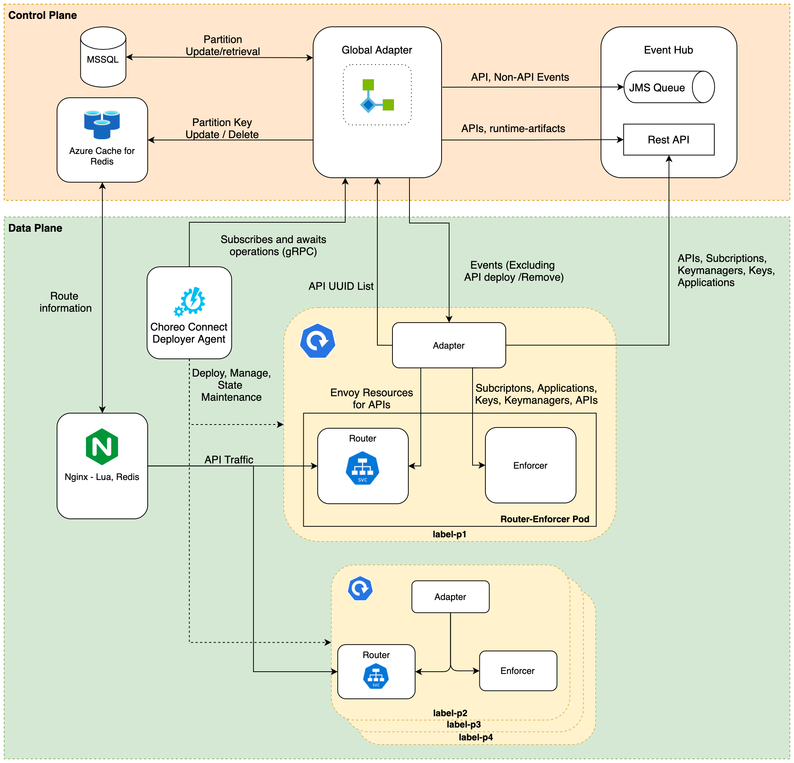

# Choreo Connect Global Adapter

In order to manage the growing number of APIs straining the envoy routers in Choreo data plane the API partitioning was required. As a method to manage the APIs and handle the API partitioning the Control Plane was introduced with the Global Adapter component to act as the partition manager for APIs. This component interacts with the API event hub to retrieve APIs and API events to handle paritioning and distribution of APIs to the respective partitions. 

## Architecture 
The architecture and the designs are discussed under the [API partitioning](https://github.com/wso2-enterprise/choreo/wiki/Choreo-Architecture-Links) section.
  * [Slide Deck](https://docs.google.com/presentation/d/1atVgz6BjN2FP-O6hYjLKm1WBE0FFBXMRhBovtoZZCpA/edit#slide=id.ga8e32a3ae0_0_1071)
  * [Initial proposal](https://docs.google.com/document/d/1g3ijX4KNdJHw5L4ud_D3CpQ7osUKgG3bZI7QtT41HmU/edit?usp=sharing)
  * [Final Document - WIP](https://docs.google.com/document/d/1zKUjRiQ1PQVDWZYjK9ns4S6ncx4Bfhn8d3fGGgNueKM/edit?usp=sharing) 

The overall architectural for APIM partition is illustrated in the following diagram. 

